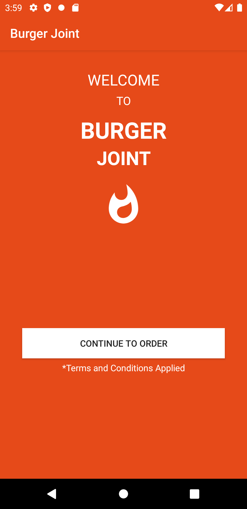
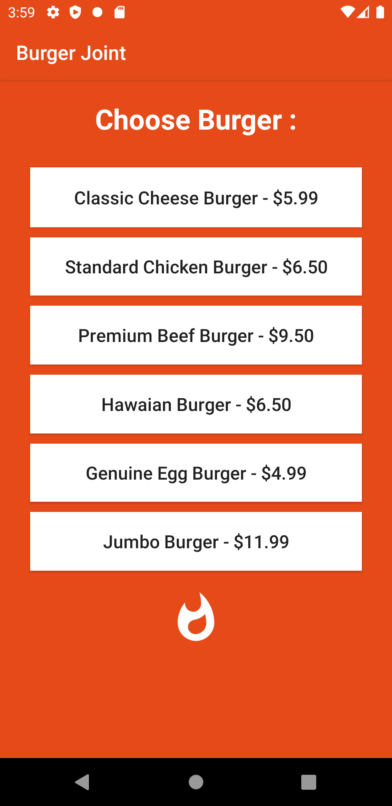
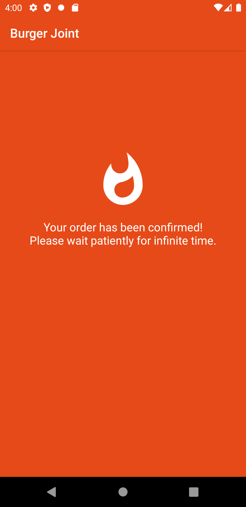

# Burger-Joint

I developed this app at the very first phrase of my development career. The code is nothing but a mess. But I have a nostalgic feeling about this one.

- Anyone is welcome to create issues and pull requests.

# License

**MIT License**

Copyright (c) 2020 Raquibul Islam

[License details](https://github.com/shubha360/Burger-Joint/blob/add-license-1/LICENSE)
